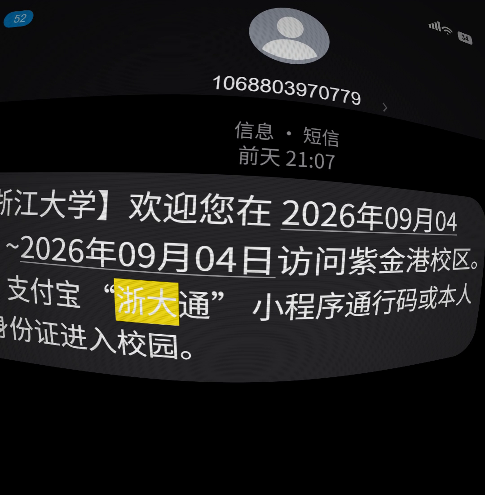

# 鱼眼畸变 · 摩尔纹 · 暗角

使用 Remotion 4.0.534、React、Canvas 2D 和 WebGL2 重建的可编辑动效。短信文字、头像、系统图标和消息气泡均由源码绘制；镜头逐帧计算，不使用参考 MP4 或截图作为画面。



参考片段：[鱼眼畸变效果](https://motionface.cc/?recording=7f6a33d3-83e5-4c41-89fe-0910881e46c6)。画布 **1080 × 1102**，**30 fps**，**60 帧 / 2 秒**。

## 运行与导出

需要 Node.js 22 或更新版本及支持 WebGL2 的 Chrome/Chromium。

```sh
npm ci
npm run dev
```

在 Studio 中选择 `FisheyeMessage`。浏览器地址以终端实际输出为准。

```sh
npm run render  # out/fisheye-moire.mp4
npm run still   # out/poster.png，第 50 帧
npm run lint    # ESLint + TypeScript
```

首次导出时 Remotion 会下载 Chrome Headless Shell。已在配置中启用 ANGLE WebGL 渲染。

## 实现与编辑

- `src/draw-message.ts`：中文短信、日期下划线、默认头像和系统图标，直接改 `MESSAGE` 和布局常量即可换内容。
- `src/Composition.tsx`：画布、时长、镜头节奏及强调动画。0.16–0.85 秒倾转并减速，1.0–1.7 秒对“浙大”作黄色擦出。
- `src/effects/lens.ts`：逆向径向畸变、透视采样、附着于源画面的细扫描线与摩尔纹、屏幕空间暗角。
- `defaultProps`：可调整 `strength`、`scanline`、`moire`、`vignette` 和 `highlightColor`。
- 源画布带 400 px 四周延展，防止鱼眼采样和倾转时出现意外黑边。
- 字体由 npm 包 `@fontsource/noto-sans-sc` 本地加载；不依赖系统中文字体或在线字体请求。数字使用 Arial / sans-serif 回退，跨平台可能存在轻微度量差异。

## 分析与验证

- [参考分析](docs/ANALYSIS.md)：关键帧、构图、材质与声音证据。
- [逐帧时间线](docs/TIMELINE.md)：黄色强调的测量值和推断曲线。
- [验证记录](docs/validation.json)：成片规格、代码检查和全片解码。
- [片段绑定结果](docs/binding-result.json)：REST API 返回 200，片段 ID 与仓库根地址均匹配。

原片音轨为数字静音，本版输出无音轨的静音 MP4。参考原始字体、镜头矩阵和原始工程不可用；本工程是独立重建，字体度量、头像轮廓、透视与高频纹理仍可能与原片有差异。技术验证不代表逐像素一致或用户审美验收。

仓库包含源码、固定版本依赖锁和可复用的特效实现；参考原片、下载签名、绑定凭证及本机私人路径不随代码发布。

Remotion 及字体分别遵循其依赖包附带的许可；参考界面文字用于本次复刻，不表示来自相关机构的官方项目。
